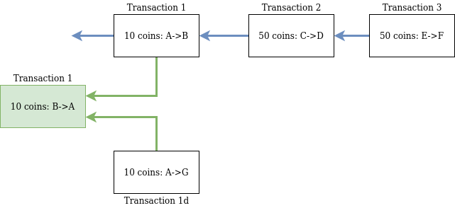

# ConsensusLessBlockchain

Implementation of a blockchain that works without consensus. 

First a group of scientiests (Rachid Guerraoui, Petr Kuznetsov, Matteo Monti, Matej Pavlovič, Dragos-Adrian Seredinschi) figured out we don't need consensus for solving the double spending problem. https://arxiv.org/pdf/1906.05574.pdf

And then more in detail Jakub Sliwinski and Roger Wattenhofer proofed an algorithm that implements this. https://arxiv.org/pdf/1909.10926.pdf

In this project I will try to implement as a proof of concept the consensus less blockchain, write a node and a wallet that can be used to interact with the chain as well as a block inspector.

In the following I try to explain in simple words what happens here. And why this is good idea.

# What is this

This is a distributed ledger. It records transactions of coins between different parties. The important thing is to make sure no one is creating any coins out of thin air. This is called double spending. If I have 50 coins and could send you 50 and my grandma 50 I could create coins that are not available. 

Traditionaly, like with Bitcoin, the participating nodes need to coordinate which transactions to write in the ledger to handle this doublespending problem. To do this a consensus algorithm is used. But as Guerraoui et al. showed this is not needed. 

Instead of communicating the whole time with everyone we say a transaction is valid when more then 50% of the total money available references this transaction and it's not a double spend. This is maybe a bit hard to grasp so I drew a little sketch.



You can see the transactions 3 referes (blue arrow) to 2 and 2 to 1 and with transitivity 3 refers to 1. Thus 100 coins are stacked on top of transaction 1. Let's say we have 150 coins in total in the system. The references would make Transaction 1 valid now as more than half of the total amount of coins in the system are stacked on top of the transaction. 

Any two transactions in the system with more the 50% stack on top of them need to have a common parent. And thus will be detected by everyone. If the two transaction double spend the coins it will be known. So no one has the incentive two act like that.

# Drawbacks

A clear drawback is that someone need to reference your transaction for it to get validated. And not just one but 50% of all the coins available. This means validation is either very slow or actors need to get incentives to move there coins and validate transactions constantly. This could be implemented by a transaction fee that will be split percentage wise by all the validators in the stack.

Another drawback is, that you can't get rid of old transactions eventually as someone could come back and double spend the money later. One might think about minimization strategies though. 

# Wallet

[The wallet I build](https://paulsbecks.github.io/consensus-less-blockchain-wallet/).

\[!important\] It is not secure, it saves your private key in the browser without any security.

# Start the node

Start the python node

```
python install -r requirements.txt
export FLASK_APP=node.py
flask run
```

Start the browser wallet

```
cd consensusless-blockchain-wallet
yarn install
yarn start
```
